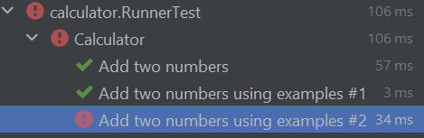
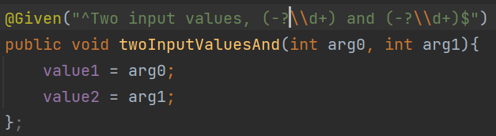
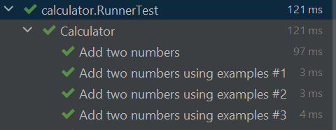
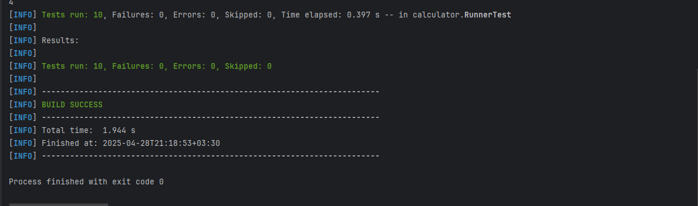

# Software_Lab_4


در این بخش به بررسی نحوه نوشتن تست‌های `BDD` برای ماشین‌حساب با استفاده از `Gherkin` می‌پردازیم. در این قالب، سناریوها برای بیان رفتارهای مورد انتظار سیستم به زبان طبیعی تعریف می‌شوند.

## معرفی سناریوهای معمولی (Scenario)

در ابتدا، از نوع ساده‌تری از سناریو استفاده می‌کنیم که در آن مقدارهای ورودی و خروجی به‌صورت صریح در خود سناریو آورده می‌شوند. به عنوان مثال:

```gherkin
@calculatorTest
Feature: Calculator

Scenario: add two numbers
  Given Two input values, 1 and 2
  When I add the two values
  Then I expect the result 3


```


در این سناریو، عملیات جمع بین دو عدد مشخص انجام شده و نتیجه مورد انتظار بررسی می‌شود.

# معرفی Scenario Outline

حال نوبت به تعریف نوع دیگری از سناریو به نام `Scenario Outline` است که آن را در ادامه فایل `feature` به صورت زیر تعریف می‌کنیم. در این نوع سناریو، از پارامترها استفاده می‌شود و چندین مثال مختلف برای اجرای تست آورده می‌شود.


```gherkin
Scenario Outline: add two numbers
  Given Two input values, <first> and <second>
  When I add the two values
  Then I expect the result <result>

  Examples:
    | first | second | result |
    | 1     | 12     | 13     |
    | -1    | 6      | 5      |
    | 2     | 2      | 4      |

```

در اینجا، سه سناریو مختلف تنها با تغییر مقادیر پارامترها تست می‌شوند.

# سناریوهای دیگر عملیات ریاضی

در ادامه، سایر عملیات پایه ماشین‌حساب را با استفاده از سناریوهای معمولی مورد تست قرار داده‌ایم:

```gherkin
Scenario: Multiplying two numbers
  Given I have entered 6 into the calculator
  And I have entered 2 into the calculator
  When I press *
  Then the result should be 12 on the screen

Scenario: Dividing two numbers
  Given I have entered 6 into the calculator
  And I have entered 2 into the calculator
  When I press /
  Then the result should be 3 on the screen

Scenario: Raising a number to the power of another
  Given I have entered 6 into the calculator
  And I have entered 2 into the calculator
  When I press ^
  Then the result should be 36 on the screen

```


# استفاده از Scenario Outline برای انواع عملیات


در نهایت می‌توانیم تمامی عملیات ریاضی را به صورت پارامتری و در یک سناریو کلی‌تر با استفاده از `Scenario Outline` پیاده‌سازی کنیم:

```gherkin

Feature: Calculator Operations

Scenario Outline: Performing an operation on two numbers
  Given I have entered <first> into the calculator
  And I have entered <second> into the calculator
  When I press <operator>
  Then the result should be <expectedResult> on the screen

  Examples:
    | first | second | operator | expectedResult |
    | 6     | 2      | *        | 12             |
    | 6     | 2      | /        | 3              |
    | 6     | 2      | ^        | 36             |
```

این روش باعث می‌شود که تنها با یک بار تعریف گام‌ها، بتوانیم چندین تست مختلف را اجرا کنیم.

#


پاسخ سوالات بخش اول (مثال):

1. تست دوم از بخش scenario outline به مشکل می خورد.

    

.

2. علت بروز این مشکل به دلیل آن است که در این تست، عدد اول مقداری منفی دارد ولی در step هایی که در `MyStepdefs` تعریف کردیم، در بخش regex آن تنها اعداد صحیح مثبت را در نظر گرفته بودیم `(\\d+)`

.

3. برای رفع این مشکل کافیست regex ای برای step ها تعریف کنیم که اعداد منفی را نیز در نظر بگیرد. از `(-?\\d+)`استفاده می کنیم.

    

همان طور که مشاهده می کنید تست ها بدون مشکل پاس می شوند:




## نتیجه اجرای تست ها

